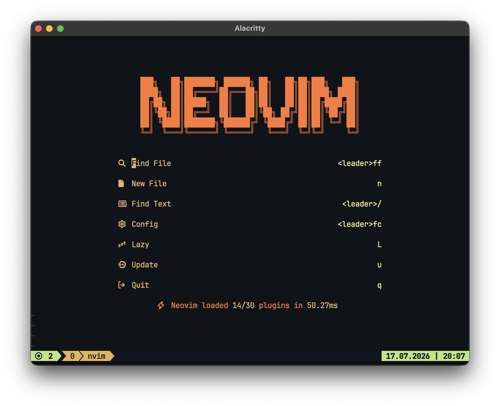

# Neovim Configuration Readme

This repository contains my personal Neovim configuration, tailored to my
preferences and workflow. Below is a brief overview of key features and how to
set it up.

This config is heavily influenced by
[kickstart](https://github.com/nvim-lua/kickstart.nvim.git)

## Features

### Plugins

Utilizes popular plugins to enhance Neovim's functionality, including:

- aerial: a code outline window for skimming and quick navigation
- blink-cmp: a modern completion engine with fuzzy matching and better UI
- conform: a formatting solution with format-on-save toggle and consistent code
  styles
- dab: Debug Adapter Protocol client with support for Python, Lua, and Go
- diffview: git diff viewer for comparing branches and changes
- fff: a fast file picker built in Rust for quick file navigation
- flash: lets you navigate your code with search labels, enhanced character
  motions, and Treesitter integration
- gitignore: a plugin to manage .gitignore files efficiently
- gitsigns: git integration for Neovim to show git change signs and perform git
  actions
- lualine: a responsive statusline written in Lua with a variety of
  configurations
- mason: easily install and manage LSP servers, linters, and formatters
- mini: a minimal and fast collection of Lua modules including text objects,
  autopairs, and surroundings
- noice: enhanced UI for command line, search, and LSP documentation
- nvim-scrollbar: a customizable scrollbar plugin for Neovim
- nvim-treesitter: better syntax highlighting and code parsing using Tree-sitter
- oil: an improved file explorer as a buffer in Neovim
- rainbow_csv: a highlighter for CSV and TSV files to enhance readability
- snacks: a collection of utilities including dashboard, picker, indent guides,
  scroll, and notifications
- techbase: a modern dark color scheme
- todo-comments: highlight and manage TODO comments within your code
- uv.nvim: integration with the uv Python package manager for smooth Python
  development in Neovim
- which-key: a keybinding helper for discovering key mappings in Neovim
- wrapped: text wrapping utilities

### Appearance

Consistent and visually pleasing color scheme and status line setup.

## Setup

The configuration uses [lazy.nvim](https://github.com/folke/lazy.nvim) for
plugin management. LSP servers are auto-discovered from the `lsp/` directory.

## Performance

The configuration optimizes Neovim's startup time by:

- Lazy-loading plugins when possible
- Disabling unnecessary built-in plugins

## Feedback

If you have any suggestions, feedback, or encounter any issues with the
configuration, feel free to open an issue or submit a pull request. Your
contributions are welcome!

Happy coding! 🚀
